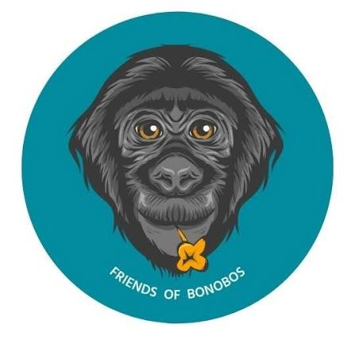

```{=html}
<style>
table {
  border-collapse: collapse;
  width: 75%;
  font-size: 14px;
  font-family: Roboto, sans-serif !important;
}
th {
  background-color: white;
  color: black !important;
  text-align: center !important;
  font-weight: bold !important;
}
th, td {
  border: 1px solid #000000 !important;
  padding: 8px 12px;
  font-size: 14px;
  font-family: Roboto, sans-serif !important;
}

.map-full-width {
  width: 100%;
}

.coverage-tabset .tab-pane {
  min-height: 624px;
}

.plotly-graph-div {
  width: 100% !important;
}

#refs {
  font-size: 12px;
}

#refs .csl-entry {
  margin-bottom: 8px;
}
</style>
```

## Summary

> *"If we can't save these animals, then there's really very little hope for the rest of biodiversity. I just can't imagine a world without these animals."* 
>
> — John Mitani (primatologist, University of Michigan) [@sherburne2024]

*This analysis examines 25 years of satellite-derived tree cover data within the ranges of all four great ape genera: chimpanzees, gorillas, bonobos, and orangutans. Between 2001 and 2025, primary great ape range countries lost approximately 84 million hectares of tree cover, equivalent to 11.8% of their combined tree cover extent in 2000. The rate of forest loss is substantially lower in protected areas, by roughly 63% in Africa and 73% in Asia. Yet only a quarter of known great ape habitat falls within protected areas. The data suggest that protection helps, but far too little habitat is protected, and loss continues even within protected boundaries. Without urgent action, the forests these animals depend on may disappear within our lifetime. And with them, our closest relatives on Earth.*      


## Overview

Great apes, our closest living relatives, are facing extinction. All four genera of non-human great apes, gorillas, chimpanzees, bonobos, and orangutans, are classified as either Endangered (EN) or Critically Endangered (CR) by the International Union for Conservation of Nature (IUCN). Without urgent action, there is a real possibility that current generations of humans will be the last to observe these animals in the wild. 

The figure below displays the IUCN's conservation status for each of the four great ape genera. Select a card to view population estimates of the species and subspecies in each genus. Estimates are drawn from IUCN Red List assessments (2017-2024). See [Sources](#sources) for full citations.  

```{=html}

<div style="display: flex; flex-wrap: wrap; gap: 16px; width: 650px; margin: 0 auto;">

<!-- ============================================================================================================= -->
<!-- Orangutan Card -->
<!-- ============================================================================================================= -->

<div style="all: initial; font-family: Roboto; border: 2px solid #dee2e6; border-radius: 4px; padding: 5px 5px 5px 10px; margin-bottom: 0; box-sizing: border-box; width: 290px; height: 290px; position: relative;">

<!-- FRONT -->
 <div id="orangutan-front" onclick="toggleCard('orangutan')" style="cursor: pointer; padding: 10px; position: absolute; top: 0; left: 0; width: 100%; box-sizing: border-box; opacity: 1; transition: opacity 0.9s ease;">
 
 <p style="font-size: 24px; font-family: Roboto; font-weight: bold; margin: 0; text-align:center;">Orangutans</p>
 <p style="font-size: 16px; font-family: Roboto; margin: 0; margin-top: 8px; font-weight: bold; text-align:center;"> <span style="color: #F03431;">Critically Endangered</span> </p>
 <p style="font-size: 14px; font-family: Roboto; margin: 0; margin-top: 8px; text-align:center;"> <i>Click to learn more </i></p>
</div>

<!-- BACK -->
  <div id="orangutan-back" onclick="toggleCard('orangutan')" 
  style="cursor: pointer; padding: 10px; position: absolute; top: 0; left: 0; width: 100%; box-sizing: border-box; overflow: hidden; opacity: 0; transition: opacity 0.9s ease;">
    <p style="font-size: 14px !important; font-family: Roboto; font-weight: bold; margin: 0; margin-bottom: 10px; margin-top: 10px; text-align:center;">Species and population estimates</p>
    <table style="width: 100%; font-size: 12px !important; font-family: Roboto; border-collapse: collapse;">
      <tr>
        <th style="border-bottom: 1px solid #dee2e6; text-align: center; padding: 4px 2px;font-size: 12px;">Species</th>
        <th style="border-bottom: 1px solid #dee2e6; text-align: center; padding: 4px 2px;font-size: 12px;">Population*</th>
        <th style="border-bottom: 1px solid #dee2e6; text-align: center; padding: 4px 2px;font-size: 12px;">Year</th>
        <th style="border-bottom: 1px solid #dee2e6; text-align: center;padding: 4px 2px;font-size: 12px;width: 40px;">Status</th>
      </tr>
      <tr>
        <td style="padding: 4px 2px;font-size: 12px; text-align: left;">Bornean</td>
        <td style="padding: 4px 2px;font-size: 12px; text-align: center;">104,700</td>
        <td style="padding: 4px 2px;font-size: 12px; text-align: center;">2016</td>
        <td style="padding: 4px 2px;font-size: 12px; text-align: center;"><span style="color: #F03431;">CR</span></td>
      </tr>
      <tr>
        <td style="padding: 4px 2px;font-size: 12px; text-align: left;">Sumatran</td>
        <td style="padding: 4px 2px;font-size: 12px; text-align: center;">13,846</td>
        <td style="padding: 4px 2px;font-size: 12px; text-align: center;">2017</td>
        <td style="padding: 4px 2px;font-size: 12px; text-align: center;"><span style="color: #F03431;">CR</span></td>
      </tr>
      <tr>
        <td style="padding: 4px 2px;font-size: 12px; text-align: left;">Tapanuli</td>
        <td style="padding: 4px 2px;font-size: 12px; text-align: center;">800</td>
        <td style="padding: 4px 2px;font-size: 12px; text-align: center;">2017</td>
        <td style="padding: 4px 2px;font-size: 12px; text-align: center;"><span style="color: #F03431;">CR</span></td>
      </tr>
    </table>
    <p style="font-size: 12px !important; color: #555555; margin-top: 16px; font-family: Roboto;">*Estimates are highly uncertain and based on infrequent ground surveys. Figures likely overestimate current populations.</p>
    <p style="font-size: 12px !important; color: #555555; margin-top: 4px; font-family: Roboto; text-align:center;"> Click to go back</p>
  </div>
</div>


<!-- ============================================================================================================= -->
<!-- Gorilla Card -->
<!-- ============================================================================================================= -->

<div style="all: initial; font-family: Roboto, sans-serif !important; width: 290px; height: 290px; border: 2px solid #dee2e6; box-sizing: border-box; border-radius: 4px; position: relative;">
  <!-- FRONT -->
  <div id="gorilla-front" onclick="toggleCard('gorilla')" 
  style="cursor: pointer; padding: 10px; position: absolute; top: 0; left: 0; width: 100%; box-sizing: border-box; opacity: 1; transition: opacity 0.9s ease;">
    
    <p style="font-size: 24px; font-family: Roboto; font-weight: bold; margin: 0; text-align:center;">Gorillas</p>
    <p style="font-size: 16px; font-family: Roboto; margin: 0; margin-top: 8px; font-weight: bold; text-align:center;"><span style="color: #F03431;">Critically Endangered</span></p>
    <p style="font-size: 14px; font-family: Roboto; margin: 0; margin-top: 8px; text-align:center;"> <i>Click to learn more</i></p>
  </div>
  <!-- BACK -->
  <div id="gorilla-back" onclick="toggleCard('gorilla')" 
  style="cursor: pointer; padding: 10px; position: absolute; top: 0; left: 0; width: 100%; box-sizing: border-box; overflow: hidden; opacity: 0; transition: opacity 0.9s ease;">
    <p style="font-size: 14px !important; font-family: Roboto; font-weight: bold; margin: 0; margin-bottom: 10px; margin-top: 10px; text-align:center;">Subspecies and population estimates</p>
    <table style="width: 100%; font-size: 10px !important; font-family: Roboto; border-collapse: collapse;">
      <tr>
        <th style="border-bottom: 1px solid #dee2e6; text-align: center; padding: 4px 2px;font-size: 12px;">Species</th>
        <th style="border-bottom: 1px solid #dee2e6; text-align: center; padding: 4px 2px;font-size: 12px;">Population*</th>
        <th style="border-bottom: 1px solid #dee2e6; text-align: center; padding: 4px 2px;font-size: 12px;">Year</th>
        <th style="border-bottom: 1px solid #dee2e6; text-align: center; padding: 4px 2px;font-size: 12px;width: 40px;">Status</th>
      </tr>
      <tr>
        <td style="padding: 4px 2px;font-size: 12px; text-align: left;">Western Lowland</td>
        <td style="padding: 4px 2px;font-size: 12px; text-align: center;">362,000</td>
        <td style="padding: 4px 2px;font-size: 12px; text-align: center;">2013</td>
        <td style="padding: 4px 2px;font-size: 12px; text-align: center;"><span style="color: #F03431;">CR</span></td>
      </tr>
      <tr>
        <td style="padding: 4px 2px;font-size: 12px; text-align: left;">Cross River</td>
        <td style="padding: 4px 2px;font-size: 12px; text-align: center;">250</td>
        <td style="padding: 4px 2px;font-size: 12px; text-align: center;">2015</td>
        <td style="padding: 4px 2px;font-size: 12px; text-align: center;"><span style="color: #F03431;">CR</span></td>
      </tr>
      <tr>
        <td style="padding: 4px 2px;font-size: 12px; text-align: left;">Mountain</td>
        <td style="padding: 4px 2px;font-size: 12px; text-align: center;">1,000</td>
        <td style="padding: 4px 2px;font-size: 12px; text-align: center;">2018</td>
        <td style="padding: 4px 2px;font-size: 12px; text-align: center;"><span style="color: #e67e22;">EN</span></td>
      </tr>
      <tr>
        <td style="padding: 4px 2px;font-size: 12px; text-align: left;">Grauer's</td>
        <td style="padding: 4px 2px;font-size: 12px; text-align: center;">3,800</td>
        <td style="padding: 4px 2px;font-size: 12px; text-align: center;">2015</td>
        <td style="padding: 4px 2px;font-size: 12px; text-align: center;"><span style="color: #F03431;">CR</span></td>
      </tr>
    </table>
    <p style="font-size: 12px !important; color: #555555; margin-top: 16px; font-family: Roboto;">*Estimates are highly uncertain and based on infrequent ground surveys. Figures likely overestimate current populations.</p>
    <p style="font-size: 12px !important; color: #555555; margin-top: 4px; font-family: Roboto; text-align:center;"> Click to go back</p>
  </div>
</div>


<!-- ============================================================================================================= -->
<!-- Chimpanzee Card -->
<!-- ============================================================================================================= -->

<div style="all: initial; font-family: Roboto; width: 290px; height: 290px; border: 2px solid #dee2e6; box-sizing: border-box; border-radius: 4px; position: relative;">
<!-- FRONT -->
 <div id="chimp-front" onclick="toggleCard('chimp')" style="cursor: pointer; padding: 10px; position: absolute; top: 0; left: 0; width: 100%; box-sizing: border-box; opacity: 1; transition: opacity 0.9s ease;">
 
 <p style="font-size: 24px; font-family: Roboto; font-weight: bold; margin: 0; text-align:center;">Chimpanzees</p>
 <p style="font-size: 16px; font-family: Roboto; margin: 0; margin-top: 8px; font-weight: bold; text-align:center;"><span style="color: #e67e22;">Endangered</span></p>
  <p style="font-size: 14px; font-family: Roboto; margin: 0; margin-top: 8px; text-align:center;"> <i>Click to learn more</i></p>
</div>

<!-- BACK -->
  <div id="chimp-back" onclick="toggleCard('chimp')" 
  style="cursor: pointer; padding: 10px; position: absolute; top: 0; left: 0; width: 100%; box-sizing: border-box; overflow: hidden; opacity: 0; transition: opacity 0.9s ease;">
    <p style="font-size: 14px !important; font-family: Roboto; font-weight: bold; margin: 0; margin-bottom: 10px; margin-top: 10px; text-align:center;">Subspecies and population estimates</p>
    <table style="width: 100%; font-size: 12px !important; font-family: Roboto; border-collapse: collapse;">
       <tr>
        <th style="border-bottom: 1px solid #dee2e6; text-align: center; padding: 4px 2px;font-size: 12px;">Species</th>
        <th style="border-bottom: 1px solid #dee2e6; text-align: center; padding: 4px 2px;font-size: 12px;">Population*</th>
        <th style="border-bottom: 1px solid #dee2e6; text-align: center; padding: 4px 2px;font-size: 12px;">Year</th>
        <th style="border-bottom: 1px solid #dee2e6; text-align: center; padding: 4px 2px;font-size: 12px;width: 40px;">Status</th>
      </tr>
      <tr>
        <td style="padding: 4px 2px;font-size: 12px; text-align: left;">Western</td>
       <td style="padding: 4px 2px;font-size: 12px; text-align: center;">18,000–65,000</td>
        <td style="padding: 4px 2px;font-size: 12px; text-align: center;">2016</td>
        <td style="padding: 4px 2px;font-size: 12px; text-align: center;"><span style="color: #e67e22;">EN</span></td>
      </tr>
      <tr>
        <td style="padding: 4px 2px;font-size: 12px; text-align: left;">Nigeria-Cameroon</td>
        <td style="padding: 4px 2px;font-size: 12px;text-align: center;">&lt;6000</td>
        <td style="padding: 4px 2px;font-size: 12px;text-align: center;">2015</td>
        <td style="padding: 4px 2px;font-size: 12px;text-align: center;"><span style="color: #F03431;">CR</span></td>
      </tr>
      <tr>
        <td style="padding: 4px 2px;font-size: 12px; text-align: left;">Central</td>
        <td style="padding: 4px 2px;font-size: 12px; text-align: center;">140,000</td>
        <td style="padding: 4px 2px;font-size: 12px; text-align: center;">2016</td>
        <td style="padding: 4px 2px;font-size: 12px; text-align: center;"><span style="color: #e67e22;">EN</span></td>
      </tr>
      <tr>
        <td style="padding: 4px 2px;font-size: 12px; text-align: left;">Eastern</td>
        <td style="padding: 4px 2px;font-size: 12px; text-align: center;">170,000–250,000</td>
        <td style="padding: 4px 2px;font-size: 12px; text-align: center;">2015</td>
        <td style="padding: 4px 2px;font-size: 12px; text-align: center;"><span style="color: #e67e22;">EN</span></td>
      </tr>
    </table>
    <p style="font-size: 12px !important; color: #555555; margin-top: 16px; font-family: Roboto;">*Estimates are highly uncertain based on infrequent ground surveys. Figures likely overestimate current populations.</p>
    <p style="font-size: 12px !important; color: #555555; margin-top: 4px; font-family: Roboto; text-align:center;"> Click to go back</p>
  </div>
</div>


<!-- ============================================================================================================= -->
<!-- Bonobo Card -->
<!-- ============================================================================================================= -->

<div style="all: initial;width: 290px; height: 290px; border: 2px solid #dee2e6; box-sizing: border-box; border-radius: 4px; position: relative;">

<!-- FRONT -->
 <div id="bonobo-front" onclick="toggleCard('bonobo')" style="cursor: pointer; padding: 10px; position: absolute; top: 0; left: 0; width: 100%; box-sizing: border-box; opacity: 1; transition: opacity 0.9s ease;">
 
 <p style="font-size: 24px; font-family: Roboto; font-weight: bold; margin: 0; text-align:center;">Bonobos</p>
 <p style="font-size: 16px; font-family: Roboto; margin: 0; margin-top: 8px; font-weight: bold; text-align:center;"> <span style="color: #e67e22;">Endangered</span> </p>
  <p style="font-size: 14px; font-family: Roboto; margin: 0; margin-top: 8px; text-align:center;"><i>Click to learn more</i></p>
</div>

<!-- BACK -->
 <div id="bonobo-back" onclick="toggleCard('bonobo')" style="cursor: pointer; padding: 10px; position: absolute; top: 0; left: 0; width: 100%; box-sizing: border-box; overflow: hidden; opacity: 0; transition: opacity 0.9s ease;">
  <p style="font-size: 14px !important; font-family: Roboto; margin: 0; margin-bottom: 10px; margin-top: 30px; text-align:left;"> Unlike other great apes, bonobos have no recognized subspecies. They exist as a single population confined entirely to the Congo Basin. <br> A 2016 survey estimated the population of bonobos to be between 15,000 and 20,000 individuals.</p>

 <p style="font-size: 12px !important; color: #555555; margin-top: 4px; font-family: Roboto; text-align:center;"> Click to go back</p>
 </div>

</div>


<script>
function toggleCard(name) {
  var front = document.getElementById(name + '-front');
  var back = document.getElementById(name + '-back');
  if (front.style.opacity === '0') {
    front.style.opacity = '1';
    back.style.opacity = '0';
  } else {
    front.style.opacity = '0';
    back.style.opacity = '1'; 
  }
}
  </script>

</div>
<style>
  .post-cards {
    all: revert;
    display: block;
    width: 100%;
  }
</style>
<div class="post-cards"></div>
```
<div style="height: 30px;"></div>

Even when considering the upper bounds of these estimates, the total population of great apes remaining on Earth is less than a million individuals. Some species have declined by over 90% since the turn of the 20th century. Great apes face a range of human-driven threats, including poaching, civil conflict, disease transmission and the illegal wildlife trade, but it is largely agreed that the most pervasive threat to their existence in the wild is the destruction of their forest habitat.     

## Methodology

### Scope
This analysis covers 12 countries representing the core great ape range across equatorial Africa and Southeast Asia: Cameroon, Central African Republic, Democratic Republic of the Congo, Gabon, Nigeria, Republic of the Congo, Rwanda, Burundi, Tanzania, Uganda, Indonesia, and Malaysia. Full native chimpanzee range extends further into West and parts of East Africa, and is not represented here.

### Data sources
Forest cover data is sourced from the Hansen Global Forest Change (GFC) dataset (GFC-2025-v1.13) [@hansen2013]. Forest is defined as areas with tree canopy cover greater than 10% in 2000, following the Food and Agricultural Organization definition. Protected area boundaries are sourced from the World Database on Protected Areas [@unepwcmc2026], and great ape range polygons from the IUCN Red List of Threatened Species spatial data. Methodological detail, including the rationale for the canopy threshold and the distinction between mapped range and true habitat, is available in [Methodological notes](#methodological-notes) below. See [Sources](#sources) for full citations. 

### Approach
The protected area effectiveness analysis clips Hansen raster data to confirmed great ape range polygons and classifies pixels as inside or outside protected areas using WDPA boundaries, comparing annual and cumulative forest loss rates (as a percentage of 2000 forest extent) between the two groups.

## Habitat loss

Most gorillas, chimpanzees and bonobos live in tropical rainforests across equatorial Africa, while orangutans are native to the forests of Southeast Asia, forests that are disappearing at an alarming rate due to human activity. The chart below illustrates the percentage and cumulative total tree cover loss in core great ape range countries from 2001 to 2025. Select the tabs to toggle between the two views. Annual loss is expressed as a percentage of each country's forest extent in 2000; cumulative loss is shown in total hectares. 


```{python}
#| output: false
import pandas as pd
import plotly.graph_objects as go

# Load data
df = pd.read_csv('Forest_data.csv', encoding='latin-1')

ape_countries = [
    'Democratic Republic of the Congo', 'Cameroon', 'Gabon',
    'Republic of the Congo', 'Central African Republic', 'Nigeria',
    'Uganda', 'Rwanda', 'Burundi', 'Tanzania',
    'Indonesia', 'Malaysia'
]

df_filtered = df[(df['threshold'] == 10) & (df['country'].isin(ape_countries))]
loss_columns = [col for col in df.columns if col.startswith('tc_loss_ha_')]
df_loss = df_filtered[['country', 'extent_2000_ha'] + loss_columns]

df_long = df_loss.melt(
    id_vars=['country', 'extent_2000_ha'],
    value_vars=loss_columns,
    var_name='year',
    value_name='forest_loss_ha'
)
df_long['year'] = df_long['year'].str.replace('tc_loss_ha_', '').astype(int)
df_long['loss_percent'] = (df_long['forest_loss_ha'] / df_long['extent_2000_ha']) * 100

# Heatmap data
df_heatmap = df_long.pivot(index='country', columns='year', values='loss_percent')
country_names = {
    'Democratic Republic of the Congo': 'DR Congo',
    'Republic of the Congo': 'Rep. of Congo',
    'Central African Republic': 'Central African Rep.'
}

df_heatmap = df_heatmap.rename(index=country_names)

# Sort by total loss
df_heatmap['total'] = df_heatmap.sum(axis=1)
df_heatmap = df_heatmap.sort_values('total', ascending=True).drop(columns='total')


# --- HEATMAP ---
fig_heat = go.Figure()
fig_heat.add_trace(go.Heatmap(
    z=df_heatmap.values,
    x=df_heatmap.columns.tolist(),
    y=df_heatmap.index.tolist(),
    xgap=1,
    ygap=1,
    zmax=1.1,
    zmin=0,
    zauto=False,
    colorscale='RdYlGn_r',
    hoverlabel=dict(bgcolor='white', bordercolor='#333333', font_size=13, align='left'),
    hovertemplate='<b>%{y}</b><br>Year: %{x}<br>Forest loss: %{z:.3f}%<extra></extra>',
colorbar=dict(
        title=dict(text='<b>Annual forest<br>loss (%)</b>', font=dict(size=12)),
        tickfont=dict(size=12),
        orientation='h',
        x=0.5,
        y=-0.25,
        xanchor='center',
        thickness=30,
        len=0.6
    )
))
fig_heat.update_layout(
    title=dict(
        text='<b>Forest loss by country, 2001–2025</b><br>'
             '<sup><i>Annual loss as % of 2000 forest extent</i></sup>',
        x=0.02
    ),
    template='simple_white',
    font_family='Roboto',
    height=600,
    margin=dict(t=60, b=130),
    xaxis=dict(
        tickmode='array',
        tickvals=[2001, 2005, 2010, 2015, 2020, 2025],
	range=[2000.5, 2025.5],
        tickfont=dict(size=13)
    ),
    yaxis=dict(tickfont=dict(size=13)),
    modebar_remove=['pan2d', 'select2d', 'lasso2d', 'zoom2d', 'zoomIn2d',
                    'zoomOut2d', 'autoScale2d', 'resetScale2d']
)
fig_heat.add_annotation(
    text="<b>Data source</b>: Hansen et al. (2013), Global Forest Change GFC-2025-v1.13; Global Forest Watch",
    xref='paper', yref='paper',
    x=-0.137, y=-0.3,
    showarrow=False,
    font=dict(size=12, color='#555555', style='italic'),
    xanchor='left',
    align='left'
)

# --- BAR CHART ---

# Cumulative raw hectares for bar chart
cumulative = df_long.groupby('country', as_index=False)['forest_loss_ha'].sum()
cumulative = cumulative.rename(columns={'forest_loss_ha': 'cumulative_loss_ha'})
cumulative['cumulative_loss_mha'] = cumulative['cumulative_loss_ha'] / 1_000_000
cumulative['country'] = cumulative['country'].replace(country_names)

fig_bar = go.Figure()
fig_bar.add_trace(go.Bar(
    x=cumulative["cumulative_loss_mha"],
    y=cumulative["country"],
    orientation='h',
    marker=dict(
        color=cumulative["cumulative_loss_mha"],
        colorscale='RdYlGn_r',
        cmin=0,
        cmax=15,
        showscale=False
    ),
    hoverlabel=dict(bgcolor='white', bordercolor='#333333', font_size=13, align='left'),
    hovertemplate='<b>%{y}</b><br>Cumulative tree cover loss: %{x:.2f} Mha<extra></extra>'
))
fig_bar.update_layout(
    title=dict(
        text='<b>Forest loss by country, 2001–2025</b><br>'
             '<sup><i>Cumulative loss in millions of hectares</i></sup>',
        x=0.02
    ),
    template='simple_white',
    font_family='Roboto',
    height=600,
    margin=dict(t=60, b=130),
    xaxis=dict(
        title='<b>Cumulative tree cover loss (Mha)</b>',
        tickfont=dict(size=13),
        fixedrange=True
    ),
    yaxis=dict(
        tickfont=dict(size=13),
        categoryorder='total ascending'
    ),
    dragmode=False,
    modebar_remove=['pan2d', 'select2d', 'lasso2d', 'zoom2d', 'zoomIn2d',
                    'zoomOut2d', 'autoScale2d', 'resetScale2d']
)


fig_bar.add_annotation(
    text="<b>Data source</b>: Hansen et al. (2013), Global Forest Change GFC-2025-v1.13; Global Forest Watch",
    xref='paper', yref='paper',
    x=-0.147, y=-0.3,
    showarrow=False,
    font=dict(size=12, color='#555555', style='italic'),
    xanchor='left',
    align='left'
)

```
::: {.panel-tabset}
## Annual
```{python}
fig_heat.show()
```
## Cumulative
```{python}
fig_bar.show()
```
:::

<div style="height: 15px;"></div>

Orangutan habitat is under immense pressure. In just the last 25 years, Malaysia and Indonesia have lost tree cover equivalent to 33% and 20% of their 2000 extent, respectively. The tropical forests in these countries are the last places on Earth where wild orangutans exist. The primary drivers of deforestation in this region are the conversion of forest to permanent agriculture, including palm oil plantations, and industrial logging (both legal and illegal). Wildfires linked to land clearing are an additional driver in Indonesia.

African countries inhabited by apes lost a combined 40.6 million hectares of forest between 2001 and 2025, an area larger than Germany. The Democratic Republic of the Congo, which contains crucial habitat for all three species of African great apes, accounts for more than half of this figure. In Africa, the leading cause of deforestation is agricultural expansion, with both permanent agriculture and shifting cultivation as dominant drivers. 

The speed at which these forests are declining is alarming. Considering the other threats great ape populations face from encroaching humans (poaching, disease transmission), effective protection of their remaining habitat is vital. 


## Protected areas

One of the primary ways governments go about slowing deforestation is through the establishment of protected areas (PAs). Protected areas are clearly defined geographical spaces which are recognized and managed through a variety of legal and other means to conserve nature [@dudley2008]. With proper enforcement, PAs can be an effective strategy to protect wildlife. However, enforcement of protection varies widely around the world. A variety of factors, chief among them insufficient governmental capacity, corruption, and industrial/economic pressure, result in many areas only being *nominally* protected. 

The IUCN classifies PAs into seven categories, ranging from restricted visitation outside of sanctioned scientific research to allowable resource extraction. 

::: {style="width: 70%; margin: 0 auto; margin-bottom: 5px;"}

| Category | Description |
|:--------:|-------------|
| Ia | Strict Nature Reserve: science only, no public access |
| Ib | Wilderness Area: minimal human impact |
| II | National Park: ecosystem protection, managed tourism |
| III | Natural Monument: protection of specific natural features |
| IV | Habitat/Species Management Area: active conservation management |
| V | Protected Landscape/Seascape: coexistence of people and nature |
| VI | Managed Resource Area: sustainable use of natural resources |
: {tbl-colwidths="[15,85]"}

:::
<div style="height: 10px;"></div>

Many protected areas within great ape ranges are listed as 'Not Applicable' or 'Not Reported' in IUCN's World Database on Protected Areas (WDPA), indicating incomplete reporting rather than absence of protection. For example, Volcanoes National Park in Rwanda, a critical mountain gorilla sanctuary, is listed without an IUCN category despite being a well-managed Category II national park.

The figure below shows protected areas overlaid with great ape ranges. Unlike the country-level figures above, the analysis that follows is confined *specifically* to land within these ranges, examining whether protection status meaningfully reduces forest loss. The Africa map groups species by genus (gorilla, chimpanzee, bonobo); the Asia map shows the three orangutan species individually, given their distinct ranges. 

```{python}
#| output: false
import folium
from folium import GeoJson, LayerControl
import geopandas as gpd

#Import shape files
ape_ranges = gpd.read_file('data/Ape_ranges.shp')
protected_areas = gpd.read_file('data/PAs_within_ape_ranges.shp')

# Fix protected areas CRS
protected_areas = protected_areas.set_crs('EPSG:4326')

# Filter to Africa species
africa_species = ['Pan troglodytes', 'Gorilla gorilla', 'Gorilla beringei','Pan paniscus']

# Filter to core range only (excludes West Africa west of 5E)
from shapely.geometry import box
core_bbox = box(5, -15, 50, 15)

ape_africa = ape_ranges[ape_ranges['sci_name'].isin(africa_species)].copy()
ape_africa = ape_africa[ape_africa.intersects(core_bbox)]

pa_africa = protected_areas[protected_areas['sci_name'].isin(africa_species)]

species_labels = {
    'Gorilla gorilla':  'Gorilla',
    'Gorilla beringei': 'Gorilla',
    'Pan troglodytes':  'Chimpanzee',
    'Pan paniscus':     'Bonobo',
}

# Add common name column
ape_africa['common_name'] = ape_africa['sci_name'].map(species_labels)

# Colour per species
species_colors = {
    'Gorilla gorilla':  '#7b2d42',
    'Gorilla beringei': '#7b2d42',
    'Pan troglodytes':  '#e07b39',
    'Pan paniscus':     '#f5c842',
}


# Build map
m_africa = folium.Map(location=[2, 19], zoom_start=5, tiles=None)
folium.TileLayer('CartoDB positron', control=False).add_to(m_africa)

# Add one layer per species
layer_groups = {
    'Chimpanzee': ['Pan troglodytes'],
    'Bonobo': ['Pan paniscus'],
    'Gorilla': ['Gorilla gorilla', 'Gorilla beringei']
}

layer_colors = {
    'Gorilla': '#7b2d42',
    'Chimpanzee': '#e07b39',
    'Bonobo': '#f5c842',
}

# Add one layer per group
for label, species_list in layer_groups.items():
    group_data = ape_africa[ape_africa['sci_name'].isin(species_list)]
    color = layer_colors[label]

    GeoJson(
        group_data,
        name=label,
        style_function=lambda x, c=color: {
            'fillColor': c,
            'color': c,
            'weight': 1,
            'fillOpacity': 0.5
        },
        tooltip=folium.GeoJsonTooltip(
            fields=['common_name'],
            aliases=['Species:']
        )
    ).add_to(m_africa)

# Protected areas layer
GeoJson(
    pa_africa,
    name='Protected Areas',
    style_function=lambda x: {
        'fillColor': '#40916c',
        'color': '#40916c',
        'weight': 1.2,
        'fillOpacity': 0.8
    },
    tooltip=folium.GeoJsonTooltip(
        fields=['NAME_ENG', 'IUCN_CAT'],
        aliases=['Protected Area:', 'IUCN Category:']
    )
).add_to(m_africa)

LayerControl(collapsed=False, title='Select layers', hide_basemap=True).add_to(m_africa)

from folium.plugins import Fullscreen

Fullscreen(
    position='topleft',
    title='Full-screen',
    title_cancel='Exit full-screen',
    force_separate_button=True
).add_to(m_africa)

css_html = '''
<style>
.leaflet-top.leaflet-right {
    margin-top: 10px;
    margin-right: 20px;
}

.leaflet-control-layers {
    font-family: Arial;
    font-size: 12px;
    border-radius: 5px;
    border: 1px solid #cccccc;
    background-color: white;
}

.leaflet-control-layers-list::before {
    content: 'Layers';
    font-weight: bold;
    font-size: 13px;
    display: block;
    margin-bottom: 8px;
    padding-bottom: 6px;
    border-bottom: 1px solid #eeeeee;
}

.leaflet-control-layers-expanded {
    padding: 8px;
    width: 160px;
}

.leaflet-control-layers label {
    margin-bottom: 6px;
    display: flex;
    align-items: center;
    gap: 6px;
}

.leaflet-control-layers-overlays {
    font-size: 13px;
}

.leaflet-control-layers-toggle {
    background-size: 20px;
}
</style>
'''
m_africa.get_root().html.add_child(folium.Element(css_html))

m_africa.save('africa_map.html')

# Asia Map

# Filter to Asia
asia_species = ['Pongo pygmaeus', 'Pongo abelii', 'Pongo tapanuliensis']

species_labels = {
    'Pongo pygmaeus':    'Bornean',
    'Pongo abelii':   'Sumatran',
    'Pongo tapanuliensis':    'Tapanuli'
}

ape_asia= ape_ranges[ape_ranges['sci_name'].isin(asia_species)]
ape_asia_dissolved = ape_asia.dissolve(by='sci_name').reset_index()
ape_asia_dissolved['common_name'] = ape_asia_dissolved['sci_name'].map(species_labels)
pa_asia = protected_areas[protected_areas['sci_name'].isin(asia_species)]

# Colour per species
species_colors = {
    'Pongo pygmaeus':    '#7b2d42',    
    'Pongo abelii':    '#e07b39',  
    'Pongo tapanuliensis':       '#f5c842',   
}


# Build map
m_asia = folium.Map(location=[1, 110], zoom_start=5, tiles=None)

#Add basemap from Carto
folium.TileLayer('CartoDB positron', control=False).add_to(m_asia)

# Add one layer per species
for species in asia_species:
    species_data = ape_asia_dissolved[ape_asia_dissolved['sci_name'] == species]
    color = species_colors[species]
    label = species_labels[species]

    GeoJson(
        species_data,
        name=label,
        style_function=lambda x, c=color: {
            'fillColor': c,
            'color': c,
            'weight': 1,
            'fillOpacity': 0.5
        },
        tooltip=folium.GeoJsonTooltip(
            fields=['common_name'],
            aliases=['Species:']
        )
    ).add_to(m_asia)

# Protected areas layer
GeoJson(
    pa_asia,
    name='Protected Areas',
    style_function=lambda x: {
        'fillColor': '#2d6a4f',
        'color': '#2d6a4f',
        'weight': 1.2,
        'fillOpacity': 0.8
    },
    tooltip=folium.GeoJsonTooltip(
        fields=['NAME_ENG', 'IUCN_CAT'],
        aliases=['Protected Area:', 'IUCN Category:']
    )
).add_to(m_asia)

LayerControl(collapsed=False, title = 'Select layers', hide_basemap=True).add_to(m_asia)

from folium.plugins import Fullscreen

Fullscreen(
    position='topleft',
    title='Full-screen',
    title_cancel='Exit full-screen',
    force_separate_button=True
).add_to(m_asia)

css_html = '''
<style>
.leaflet-top.leaflet-right {
    margin-top: 10px;
    margin-right: 10px;
}

.leaflet-control-layers {
    font-family: Arial;
    font-size: 14px;
    border-radius: 5px;
    border: 1px solid #cccccc;
    background-color: white;
}

.leaflet-control-layers-list::before {
    content: 'Layers';
    font-weight: bold;
    font-size: 13px;
    display: block;
    margin-bottom: 8px;
    padding-bottom: 6px;
    border-bottom: 1px solid #eeeeee;
}

.leaflet-control-layers-expanded {
    padding: 8px;
    width: 160px;
    max-height: none !important;
}

.leaflet-control-layers label {
    margin-bottom: 6px;
    display: flex;
    align-items: center;
    gap: 6px;
}

.leaflet-control-layers-overlays {
    font-size: 13px;
}

.leaflet-control-layers-scrollbar {
    overflow: visible !important;
}
.leaflet-control-layers-toggle {
    background-size: 20px;
}
</style>
'''
m_asia.get_root().html.add_child(folium.Element(css_html))


m_asia.save('asia_map.html')


```
```{=html}
<div class="map-full-width">

<div style="margin-bottom: 0px; text-align:left; border-bottom: 1px solid #dee2e6;">
  <button onclick="showMap('africa')" id="btn-africa"
    style="padding: 8px 20px; font-family: Roboto; font-size: 18px;
    background-color: white; color: #000; border: 1px solid #dee2e6; border-bottom: 2px solid white;
    border-radius: 4px 4px 0 0; cursor: pointer; margin-bottom: -1px;">
    Africa
  </button>
  <button onclick="showMap('asia')" id="btn-asia"
    style="padding: 8px 20px; font-family: Roboto; font-size: 18px;
    background-color: transparent; color: #18bc9c; border: none;
    cursor: pointer; margin-left: 4px;">
    Asia
  </button>
</div>

<div id="panel-africa" style="border: 1px solid #dee2e6; border-radius: 0 4px 4px 4px; padding: 15px 15px 8px 15px; margin-bottom: 0;">

  <p style="font-size: 20px; font-family: Roboto; font-weight: bold; margin-left: 10px; margin-bottom: 4px;">Protected areas within great ape ranges, Africa</p>
  <p style="font-size: 13px; font-family: Roboto; font-style: italic; color: #555; margin-left: 10px; margin-bottom: 8px;">Click layers to toggle species and protected areas on and off</p>
  <iframe src="africa_map.html" width="100%" height="600px" frameborder="0"></iframe>
  <div style="text-align: center;">
    <p style="font-size: 15px; color: black; margin-top: 0px; margin-bottom: 10px; text-align: center;">
      <span style="color: #7b2d42">■</span> Gorilla &nbsp;
      <span style="color: #e07b39">■</span> Chimpanzee &nbsp;
      <span style="color: #f5c842">■</span> Bonobo &nbsp;
      <span style="color: #2d6a4f">■</span> Protected Areas
    </p>
    <p style="font-size: 13px; font-family: Roboto; font-style: italic; color: #555; margin-left: 10px; margin-bottom: 8px; text-align: left"><b>Data source</b>: IUCN Red List of Threatened Species (2024); UNEP-WCMC and IUCN (2026), Protected Planet: The World Database on Protected Areas (WDPA)</p>
  </div>
</div>

<div id="panel-asia" style="display:none; border: 1px solid #dee2e6; border-radius: 0 4px 4px 4px; padding: 15px 15px 8px 15px; margin-bottom: 0;">
  <p style="font-size: 20px; font-family: Roboto; font-weight: bold; margin-left: 10px; margin-bottom: 4px;">Protected areas within great ape ranges, Asia</p>
  <p style="font-size: 13px; font-family: Roboto; font-style: italic; color: #555; margin-left: 10px; margin-bottom: 8px;">Click layers to toggle species and protected areas on and off</p>
  <iframe src="asia_map.html" width="100%" height="600px" frameborder="0"></iframe>
  <div style="text-align: center;">
    <p style="font-size: 15px; color: black; margin-top: 0px; margin-bottom: 10px; text-align: center;">
      <span style="color: #7b2d42">■</span> Bornean Orangutan &nbsp;
      <span style="color: #e07b39">■</span> Sumatran Orangutan &nbsp;
      <span style="color: #f5c842">■</span> Tapanuli Orangutan &nbsp;
      <span style="color: #2d6a4f">■</span> Protected Areas
    </p>
    <p style="font-size: 13px; font-family: Roboto; font-style: italic; color: #555; margin-left: 10px; margin-bottom: 8px; text-align: left"><b>Data source</b>: IUCN Red List of Threatened Species (2024); UNEP-WCMC and IUCN (2026), Protected Planet: The World Database on Protected Areas (WDPA)</p>
  </div>
</div>

</div>

<script>
function showMap(region) {
  document.getElementById('panel-africa').style.display = region === 'africa' ? 'block' : 'none';
  document.getElementById('panel-asia').style.display = region === 'asia' ? 'block' : 'none';

  const africaBtn = document.getElementById('btn-africa');
  const asiaBtn = document.getElementById('btn-asia');

  if (region === 'africa') {
    africaBtn.style.color = '#000';
    africaBtn.style.backgroundColor = 'white';
    africaBtn.style.border = '1px solid #dee2e6';
    africaBtn.style.borderBottom = '2px solid white';
    africaBtn.style.borderRadius = '4px 4px 0 0';

    asiaBtn.style.fontWeight = 'normal';
    asiaBtn.style.color = '#18bc9c';
    asiaBtn.style.backgroundColor = 'transparent';
    asiaBtn.style.border = 'none';
  } else {
    asiaBtn.style.color = '#000';
    asiaBtn.style.backgroundColor = 'white';
    asiaBtn.style.border = '1px solid #dee2e6';
    asiaBtn.style.borderBottom = '2px solid white';
    asiaBtn.style.borderRadius = '4px 4px 0 0';

    africaBtn.style.fontWeight = 'normal';
    africaBtn.style.color = '#18bc9c';
    africaBtn.style.backgroundColor = 'transparent';
    africaBtn.style.border = 'none';
  }
}
</script>
```
<div style="height: 20px;"></div>

What immediately jumps out from the figure is the large proportion of great ape ranges which have no protection status at all. Upon further analysis, the data shows that only 25.6% of mapped ape ranges fall within protected areas. This 25.6% figure varies considerably by country, however. The figure below presents the percentage and cumulative amount of great ape range which falls within a protected area, broken down by country.    


```{python}
#| output: false
import plotly.graph_objects as go

coverage_df = pd.read_csv("pa_coverage_by_country.csv")

coverage_df['range_area_mha'] = coverage_df['range_area_ha'] / 1_000_000
coverage_df['pa_area_mha'] = coverage_df['pa_area_ha'] / 1_000_000

country_names = {
    'Democratic Republic of the Congo': 'DR Congo',
    'Republic of the Congo': 'Rep. of Congo',
    'Central African Republic': 'Central African Rep.'
}
coverage_df['country'] = coverage_df['country'].replace(country_names)

# --- TAB 1: % of ape range within PA, by country ---
coverage_sorted = coverage_df.sort_values('pct_covered', ascending=True)

fig_coverage_pct = go.Figure()
fig_coverage_pct.add_trace(go.Bar(
    x=coverage_sorted['pct_covered'],
    y=coverage_sorted['country'],
    orientation='h',
    marker=dict(
        color=coverage_sorted['pct_covered'],
        colorscale='RdYlGn',
        cmin=0,
        cmax=70,
        showscale=False
    ),
    hovertemplate='<b>%{y}</b><br>Ape range within PA: %{x:.1f}%<extra></extra>'
))
fig_coverage_pct.update_layout(
    title=dict(
        text='<b>Great ape range within protected areas, by country</b><br>'
             '<sup><i>Percentage of confirmed ape range falling within a protected area boundary</i></sup>',
        x=0.02
    ),
    template='simple_white',
    font_family='Roboto',
    height=620,
    margin=dict(t=50, b=150),
    xaxis=dict(
        title='<b>Ape range within protected areas (%)</b>',
        tickfont=dict(size=13),
        fixedrange=True
    ),
    yaxis=dict(
        tickfont=dict(size=13),
        categoryorder='total ascending'
    ),
    dragmode=False,
    modebar_remove=['pan2d', 'select2d', 'lasso2d', 'zoom2d', 'zoomIn2d',
                    'zoomOut2d', 'autoScale2d', 'resetScale2d']
)
fig_coverage_pct.update_layout(
    hoverlabel=dict(bgcolor='white', bordercolor='#333333', font_size=13, align='left')
)
fig_coverage_pct.add_annotation(
    text="<b>Data source</b>: IUCN Red List of Threatened Species (2024); UNEP-WCMC and IUCN (2026), Protected Planet: The World Database on Protected <br>Areas (WDPA)",
    xref='paper', yref='paper',
    x=-0.18, y=-0.3,
    showarrow=False,
    font=dict(size=12, color='#555555', style='italic'),
    xanchor='left',
    align='left'
)

# --- TAB 2: Total ape range vs protected area coverage, by country ---
coverage_sorted2 = coverage_df.sort_values('range_area_mha', ascending=True)

fig_coverage_area = go.Figure()
fig_coverage_area.add_trace(go.Bar(
    x=coverage_sorted2['range_area_mha'],
    y=coverage_sorted2['country'],
    orientation='h',
    name='<b>Total ape range</b>',
    marker=dict(color='#DC3B2C'),
    hovertemplate='<b>%{y}</b><br>Total ape range: %{x:.2f} Mha<extra></extra>'
))
fig_coverage_area.add_trace(go.Bar(
    x=coverage_sorted2['pa_area_mha'],
    y=coverage_sorted2['country'],
    orientation='h',
    name='<b>Within protected areas</b>',
    marker=dict(color='#15904C'),
    hovertemplate='<b>%{y}</b><br>Protected area coverage: %{x:.2f} Mha<extra></extra>'
))
fig_coverage_area.update_layout(
    title=dict(
        text='<b>Total ape range vs. protected area coverage, by country</b><br>'
             '<sup><i>Cumulative area in millions of hectares</i></sup>',
        x=0.02
    ),
    template='simple_white',
    font_family='Roboto',
    height=620,
    margin=dict(t=50, b=150),
    barmode='overlay',
    xaxis=dict(
        title='<b>Area (Mha)</b>',
        tickfont=dict(size=13),
        fixedrange=True
    ),
    yaxis=dict(
        tickfont=dict(size=13),
        categoryorder='array',
        categoryarray=coverage_sorted2['country'].tolist()
    ),
    legend=dict(orientation='h', y=-0.15, x=0.5, xanchor='center'),
    dragmode=False,
    modebar_remove=['pan2d', 'select2d', 'lasso2d', 'zoom2d', 'zoomIn2d',
                    'zoomOut2d', 'autoScale2d', 'resetScale2d']
)
fig_coverage_area.update_layout(
    hoverlabel=dict(bgcolor='white', bordercolor='#333333', font_size=13, align='left')
)
fig_coverage_area.add_annotation(
    text="<b>Data source</b>: IUCN Red List of Threatened Species (2024); UNEP-WCMC and IUCN (2026), Protected Planet: The World Database on Protected <br>Areas (WDPA)",
    xref='paper', yref='paper',
    x=-0.18, y=-0.32,
    showarrow=False,
    font=dict(size=12, color='#555555', style='italic'),
    xanchor='left',
    align='left'
)

```

::: {.panel-tabset .coverage-tabset}
## % of Range Protected
```{python}
fig_coverage_pct.show()
```
## Range vs. PA Area
```{python}
fig_coverage_area.show()
```
## Summary Table

<p style="font-size: 16px; text-align: left; font-family: Roboto; margin-bottom: 5px; color: #000000;"><b>Great ape range and protected area coverage by country</b></p>

| Country              |   Ape Range (Mha) |   PA Coverage (Mha) |   % Protected |
|:---------------------|------------------:|--------------------:|--------------:|
| Nigeria              |              3.06 |                1.96 |          64.2 |
| Uganda               |              2.03 |                1.29 |          63.6 |
| Rep. of Congo        |             24.67 |               14.44 |          58.5 |
| Rwanda               |              0.26 |                0.14 |          56.5 |
| Tanzania             |              1.66 |                0.48 |          28.8 |
| Gabon                |             25.47 |                6.71 |          26.3 |
| Indonesia            |             23.56 |                5.07 |          21.5 |
| DR Congo             |            123.03 |               25.49 |          20.7 |
| Malaysia             |              4.92 |                1.01 |          20.5 |
| Cameroon             |             23.49 |                4.22 |          18.0 |
| Central African Rep. |             12.78 |                1.92 |          15.0 |
| Burundi              |              0.62 |                0.05 |          8.30 |
| **Total**            |        **245.55** |           **62.78** |      **25.6** |


<p style="font-size: 12px; text-align: left;color: #555555;"> <i><b>Data source</b>: IUCN Red List of Threatened Species (2024); UNEP-WCMC and IUCN (2026), Protected Planet: The World Database on Protected Areas (WDPA)</i></p>
:::

Notably, percentage coverage does not always track absolute protection. DR Congo has the largest area protected in this analysis by far, but it still represents just 20.7% of total great ape range, demonstrating that raw percentages can understate the scale of protection in large-range countries. 

By contrast, Rwanda has one of the highest protection percentages, but a comparatively tiny ape range. That smaller, more concentrated range may have made sustained, effective conservation more achievable. Rwanda's protected areas have contributed to one of the few success stories in great ape conservation, as its native mountain gorilla population is the only great ape taxon known to be increasing [@plumptre2019]. 

While important, coverage percentage alone cannot indicate enforcement quality. The following section examines whether protected status corresponds to measurably lower forest loss.

## Does protection reduce forest loss?
Despite generally low coverage of protected areas within great ape range, their effectiveness is nonetheless an important consideration for conservation. If the protected areas demonstrably reduce habitat loss, this strengthens the case for their continued establishment and enforcement. The figure below shows cumulative and annual forest loss within and outside of established protected areas, both regionally and, using the menu, for individual countries.    

```{python}
#| output: false
import pandas as pd
import plotly.graph_objects as go

# --- Shared layout settings ---
LAYOUT_SHARED = dict(
    template='simple_white',
    font_family='Roboto',
    title_font_size=18,
    height=600,
    margin=dict(t=100, b=150),
    modebar_remove=['pan2d', 'select2d', 'lasso2d', 'zoom2d', 'autoScale2d', 'resetScale2d', 'zoomIn2d', 'zoomOut2d']
)

# --- Load country-level data ---
ape_countries = ['Cameroon', 'Central African Republic', 'Democratic Republic of the Congo',
                  'Gabon', 'Nigeria', 'Republic of the Congo', 'Rwanda', 'Burundi',
                  'Tanzania', 'Uganda', 'Indonesia', 'Malaysia']

country_names = {
    'Democratic Republic of the Congo': 'DR Congo',
    'Republic of the Congo': 'Rep. of Congo',
    'Central African Republic': 'Central Afr. Rep.'
}

df = pd.read_csv("pa_effectiveness_by_country_combined.csv")
df['loss_pixels_inside'] = (df['loss_pct_inside_pa'] / 100) * df['pixels_inside_pa']
df['loss_pixels_outside'] = (df['loss_pct_outside_pa'] / 100) * df['pixels_outside_pa']

# Cumulative totals per country
country_cumulative = df.groupby('country', as_index=False).agg(
    total_loss_inside=('loss_pixels_inside', 'sum'),
    total_loss_outside=('loss_pixels_outside', 'sum'),
    pixels_inside_pa=('pixels_inside_pa', 'first'),
    pixels_outside_pa=('pixels_outside_pa', 'first')
)
country_cumulative['pct_inside'] = (country_cumulative['total_loss_inside'] / country_cumulative['pixels_inside_pa']) * 100
country_cumulative['pct_outside'] = (country_cumulative['total_loss_outside'] / country_cumulative['pixels_outside_pa']) * 100
country_cumulative = country_cumulative[country_cumulative['country'].isin(ape_countries)].copy()
country_cumulative['display_name'] = country_cumulative['country'].replace(country_names)

country_annual = df[df['country'].isin(ape_countries)].copy()
country_annual['display_name'] = country_annual['country'].replace(country_names)

# --- Regional totals (Africa / Asia) ---
africa_countries = ['Cameroon', 'Central African Republic', 'Democratic Republic of the Congo',
                     'Gabon', 'Nigeria', 'Republic of the Congo', 'Rwanda', 'Burundi',
                     'Tanzania', 'Uganda']
asia_countries = ['Indonesia', 'Malaysia']

def regional_pct(countries):
    subset = country_cumulative[country_cumulative['country'].isin(countries)]
    total_in = subset['total_loss_inside'].sum()
    total_out = subset['total_loss_outside'].sum()
    pix_in = subset['pixels_inside_pa'].sum()
    pix_out = subset['pixels_outside_pa'].sum()
    return (total_in / pix_in) * 100, (total_out / pix_out) * 100

africa_pct_in, africa_pct_out = regional_pct(africa_countries)
asia_pct_in, asia_pct_out = regional_pct(asia_countries)

# --- Regional annual data (for line chart) — built from the same corrected source ---
def build_regional_annual(countries, region_name):
    subset = country_annual[country_annual['country'].isin(countries)]
    regional = subset.groupby('year', as_index=False).agg(
        loss_pixels_inside=('loss_pixels_inside', 'sum'),
        loss_pixels_outside=('loss_pixels_outside', 'sum'),
        pixels_inside_pa=('pixels_inside_pa', 'sum'),
        pixels_outside_pa=('pixels_outside_pa', 'sum')
    )
    regional['loss_pct_inside_pa'] = (regional['loss_pixels_inside'] / regional['pixels_inside_pa']) * 100
    regional['loss_pct_outside_pa'] = (regional['loss_pixels_outside'] / regional['pixels_outside_pa']) * 100
    regional['region'] = region_name
    return regional

africa = build_regional_annual(africa_countries, 'Africa')
asia = build_regional_annual(asia_countries, 'Asia')

# =========================================================
# --- FIGURE 1: Cumulative bar chart with country dropdown ---
# =========================================================
fig = go.Figure()

fig.add_trace(go.Bar(
    x=['Africa', 'Asia'],
    y=[africa_pct_in, asia_pct_in],
    name='<b>Inside Protected Areas</b>',
    marker_color='#2c6b4f',
    hovertemplate='<b>%{x}</b><br>Inside PAs: %{y:.1f}%<extra></extra>'
))
fig.add_trace(go.Bar(
    x=['Africa', 'Asia'],
    y=[africa_pct_out, asia_pct_out],
    name='<b>Outside Protected Areas</b>',
    marker_color='#8B1E3F',
    hovertemplate='<b>%{x}</b><br>Outside PAs: %{y:.1f}%<extra></extra>'
))

bar_buttons = [
    dict(
        label='Regional only',
        method='update',
        args=[
            {'x': [['Africa', 'Asia'], ['Africa', 'Asia']],
             'y': [[africa_pct_in, asia_pct_in], [africa_pct_out, asia_pct_out]]},
            {'title.text': '<b>Forest loss inside vs outside protected areas, 2001–2025</b><br><sup><i>Expressed as % of 2000 forest extent within great ape ranges</i></sup>'}
        ]
    )
]

for _, row in country_cumulative.iterrows():
    name = row['display_name']
    bar_buttons.append(dict(
        label=name,
        method='update',
        args=[
            {'x': [['Africa', 'Asia', name], ['Africa', 'Asia', name]],
             'y': [[africa_pct_in, asia_pct_in, row['pct_inside']],
                   [africa_pct_out, asia_pct_out, row['pct_outside']]]},
            {'title.text': f'<b>Forest loss inside vs outside protected areas, 2001–2025</b><br><sup><i>Africa, Asia, and {name}</i></sup>'}
        ]
    ))

fig.update_layout(
    title=dict(
        text='<b>Forest loss inside vs outside protected areas, 2001–2025</b><br>'
             '<sup><i>Expressed as % of 2000 forest extent within great ape ranges</i></sup>',
        x=0.02,
	font=dict(size=18)
    ),
    template='simple_white',
    font_family='Roboto',
    height=600,
    margin=dict(t=100, b=130),
    yaxis=dict(title='<b>Cumulative forest cover loss (%)</b>', tickfont=dict(size=13), fixedrange=True),
    xaxis=dict(tickfont=dict(size=13)),
    barmode='group',
    dragmode=False,
    legend=dict(
        font=dict(size=13),
        orientation='h',
        x=0.5,
        y=-0.12,
        xanchor='center'
    ),
    modebar_remove=['pan2d', 'select2d', 'lasso2d', 'zoom2d', 'zoomIn2d',
                    'zoomOut2d', 'autoScale2d', 'resetScale2d'],
    updatemenus=[dict(
        buttons=bar_buttons,
        direction='down',
        x=0.98, y=1.15,
        showactive=True
    )],
    hoverlabel=dict(bgcolor='white', bordercolor='#333333', font_size=13, align='left')
)
fig.add_annotation(
    text="<b>Data source</b>: Hansen et al. (2013), Global Forest Change GFC-2025-v1.13; UNEP-WCMC and IUCN (2026), Protected Planet: The World Database <br>on Protected Areas (WDPA)",
    xref='paper', yref='paper',
    x=-0.06, y=-0.35,
    showarrow=False,
    font=dict(size=12, color='#555555', style='italic'),
    xanchor='left',
    align='left'
)

# =========================================================
# --- FIGURE 2: Annual line chart with country dropdown ---
# =========================================================
fig_line_pa = go.Figure()

fig_line_pa.add_trace(go.Scatter(
    x=africa['year'], y=africa['loss_pct_inside_pa'],
    name='<b>Africa — Inside PAs</b>',
    mode='lines', line=dict(color='#2d6a4f', width=3),
    hovertemplate='<b>Africa — Inside PAs</b><br>%{y:.2f}%<extra></extra>',
    visible=True
))
fig_line_pa.add_trace(go.Scatter(
    x=africa['year'], y=africa['loss_pct_outside_pa'],
    name='<b>Africa — Outside PAs</b>',
    mode='lines', line=dict(color='#2d6a4f', width=2, dash='dot'),
    hovertemplate='<b>Africa — Outside PAs</b><br>%{y:.2f}%<extra></extra>',
    visible=True
))
fig_line_pa.add_trace(go.Scatter(
    x=asia['year'], y=asia['loss_pct_inside_pa'],
    name='<b>Asia — Inside PAs</b>',
    mode='lines', line=dict(color='#7b2d42', width=3),
    hovertemplate='<b>Asia — Inside PAs</b><br>%{y:.2f}%<extra></extra>',
    visible=True
))
fig_line_pa.add_trace(go.Scatter(
    x=asia['year'], y=asia['loss_pct_outside_pa'],
    name='<b>Asia — Outside PAs</b>',
    mode='lines', line=dict(color='#7b2d42', width=2, dash='dot'),
    hovertemplate='<b>Asia — Outside PAs</b><br>%{y:.2f}%<extra></extra>',
    visible=True
))

country_trace_start = len(fig_line_pa.data)

for country in ape_countries:
    subset = country_annual[country_annual['country'] == country].sort_values('year')
    name = subset['display_name'].iloc[0]

    fig_line_pa.add_trace(go.Scatter(
        x=subset['year'], y=subset['loss_pct_inside_pa'],
        name=f'<b>{name} — Inside PAs</b>',
        mode='lines', line=dict(color='#4472C4', width=3),
        hovertemplate=f'<b>{name} — Inside PAs</b><br>%{{y:.2f}}%<extra></extra>',
        visible=False
    ))
    fig_line_pa.add_trace(go.Scatter(
        x=subset['year'], y=subset['loss_pct_outside_pa'],
        name=f'<b>{name} — Outside PAs</b>',
        mode='lines', line=dict(color='#4472C4', width=2, dash='dot'),
        hovertemplate=f'<b>{name} — Outside PAs</b><br>%{{y:.2f}}%<extra></extra>',
        visible=False
    ))

total_traces = len(fig_line_pa.data)

def visibility_mask(selected_country_idx=None):
    mask = [True, True, True, True] + [False] * (total_traces - 4)
    if selected_country_idx is not None:
        pair_start = country_trace_start + (selected_country_idx * 2)
        mask[pair_start] = True
        mask[pair_start + 1] = True
    return mask

line_buttons = [
    dict(
        label='Regional only',
        method='restyle',
        args=[{'visible': visibility_mask()}]
    )
]

for i, country in enumerate(ape_countries):
    name = country_names.get(country, country)
    line_buttons.append(dict(
        label=name,
        method='restyle',
        args=[{'visible': visibility_mask(i)}]
    ))

fig_line_pa.update_layout(
    title=dict(
        text='<b>Forest loss inside vs outside protected areas, 2001–2025</b><br>'
             '<sup><i>Expressed as % of 2000 forest extent within great ape ranges</i></sup>',
        x=0.02
    ),
    yaxis=dict(title='<b>Annual forest cover loss (%)</b>', showgrid=False),
    xaxis=dict(
        tickfont=dict(size=14),
        tickmode='array',
        tickvals=[2001, 2005, 2010, 2015, 2020, 2025],
        showgrid=False
    ),
    hoverlabel=dict(bgcolor='white', bordercolor='#333333', font_size=13, align='left'),
    hovermode='x unified',
    hoversort ='value descending',
    legend=dict(
        font=dict(size=13),
        orientation='h',
        x=0.5,
        y=-0.17,
        xanchor='center'
    ),
    updatemenus=[dict(
        buttons=line_buttons,
        direction='down',
        x=0.98, y=1.15,
        xanchor='right',
        showactive=True
    )],
    **LAYOUT_SHARED
)
fig_line_pa.add_annotation(
    text="<i>Click a legend item to hide it — double click to isolate</i>",
    xref='paper', yref='paper',
    x=0.5, y=-0.18,
    showarrow=False,
    font=dict(size=11, color='#888888'),
    xanchor='center',
    align='center'
)
fig_line_pa.add_annotation(
    text="<b>Data source</b>: Hansen et al. (2013), Global Forest Change GFC-2025-v1.13; UNEP-WCMC and IUCN (2026), Protected Planet: The World Database <br>on Protected Areas (WDPA)",
    xref='paper', yref='paper',
    x=-0.07, y=-0.43,
    showarrow=False,
    font=dict(size=12, color='#555555', style='italic'),
    xanchor='left',
    align='left'
)


```

::: {.panel-tabset}
## Cumulative
```{python}
fig.show()
```
## Annual
```{python}
fig_line_pa.show()
```
:::

As the figure shows, forest loss within protected areas was meaningfully lower than outside protected areas, by approximately 63% in Africa and 73% in Asia. The most dramatic effect is Malaysia, where forest loss inside protected areas (1.9%) was roughly 94% lower than outside (31.7%). This gap suggests that expanding protected coverage, currently just a fifth of Malaysia's great ape range, may offer real conservation returns, though effectiveness likely depends on enforcement capacity. 

Another notable pattern appears in Indonesia. Ranges within Indonesian protected areas have consistently lower forest loss than those outside them, but in 2016, the pattern reversed, with loss inside protected areas exceeding loss outside by roughly one percentage point. This coincides with the catastrophic 2015 El Niño fire season. Loss driven by fires burning in late 2015 is commonly recorded in the following year in the Hansen data, since detection depends on the subsequent year's cloud-free imagery. Whatever the exact attribution year, the lesson holds: fire and extreme climate events do not respect protection boundaries the way deliberate clearing and logging do.

The data also point to effective protection in Rwanda, where high protection percentages correspond to substantially reduced forest loss by over 10-fold (90.4% less), reinforcing the earlier point that Rwanda's high coverage percentage reflects a real conservation outcome, not just a favorable statistic. However, Rwanda's extremely small ape range is likely also a factor in this effectiveness; a smaller, more concentrated area may simply be easier to protect consistently than a larger one. 

Republic of Congo offers a useful comparison. It has a much larger ape range, but a comparable protection percentage. Here, forest loss inside protected areas was only about 2 percentage points lower than outside over the full period (a 54.5% relative reduction), a far smaller gap than Rwanda's. Concerningly, by 2024 and 2025, that gap had nearly disappeared, with loss rates inside and outside protected areas converging to nearly identical levels.

A note on interpretation. These comparisons show that forest loss is associated with protection status, not that protection *caused* the difference. Protected areas are rarely placed at random. Governments tend to protect land that is steep, remote, distant from roads and markets, and poorly suited to agriculture, the land least likely to have been cleared in any case. Some portion of the gap observed here therefore reflects where protected areas were placed rather than what protection accomplished, and the true effect of protection is likely smaller than these raw differences suggest. Quantifying it properly requires matching protected pixels to unprotected ones with comparable slope, elevation, and distance to roads and settlements, then comparing loss within matched pairs [@joppa2009]. That analysis is beyond the scope of this piece, but it is the natural next step, and the figures here should be read as an *upper bound* on protection's effect rather than an estimate of it.

## Conclusion
It is difficult to overstate the seriousness of the situation facing great apes in the wild today. All four genera are on the brink of extinction. The countries they inhabit lost a combined 84 million hectares of tree cover in just the past 25 years, equivalent to 11.8% of their tree cover extent in 2000. The cause of forest loss varies by country, but the primary drivers are agricultural conversion and logging. 

Governments have established protected areas to slow this trend. This analysis found that forest loss is substantially lower within protected areas in great ape ranges: 63% in African countries and 73% in Asian countries. While this is an encouraging result, only about a quarter of confirmed ape ranges fall within protected areas. Effectiveness also varies greatly by country. In Malaysia, the rate of forest loss was 94% less within protected great ape ranges, a striking result that could support the case for further establishment and enforcement of PAs in the region. Conversely, the rate of loss in countries like the DR Congo and Republic of Congo was closer to 55-60% lower within PAs than outside of them - still meaningful, but a noticeably smaller effect. Protection also appears to be more effective against deliberate clearing and logging than against unpredictable climate events, as Indonesia's 2015–16 fire season illustrated, when loss inside protected areas briefly exceeded loss outside them entirely. 

It is beyond the scope of this analysis to explore what specific interventions have driven the large variation in effectiveness among countries. Enforcement capacity, funding, community engagement, remoteness, threat types (fire versus deliberate clearing, for instance), all likely play a role, and disentangling them would require research beyond what satellite-derived forest data alone can offer. 

What the data do support is a clear, evidence-based starting point for where protection is working well, and where it may need more scrutiny, from Malaysia's strong results to the narrowing gaps seen elsewhere. As habitat loss accelerates across great ape range, understanding whether the primary tool for protecting what remains is actually working matters more than ever.

## Support great ape conservation
Great apes need our help, and we have a responsibility to protect them. Below are a few of the most reputable great ape conservation organizations. Click on the logos below to make a donation. 


<div style="height: 20px;"></div>

<div style="display: grid; grid-template-columns: repeat(2, 280px); justify-content: center; gap: 30px;">

<!-- Dian Fossey -->
<div style="text-align: center;">
<a href="https://gorillafund.org/?campaign=706580" title = "Donate to the Dian Fossey Gorilla Fund" target = "_blank">

</a>
<p style="font-size: 16px; margin: 0; min-height: 40px; display: flex; align-items: flex-end; justify-content: center;"><strong>Dian Fossey Gorilla Fund</strong></p>
<p style="font-size: 12px; margin-top: 0px; margin-bottom: 0;">Supports the endangered mountain gorilla subspecies in the forests of Rwanda, Uganda and DR Congo</p>
</div>


<!-- Jane Goodall -->
<div style="text-align: center;">
<a href="https://give.janegoodall.org/page/91035/donate&utm_medium=website/1?_gl=1*1fq1r2q*_gcl_au*NzcxNzE4NzE3LjE3ODI4MzQyMzQ.*_ga*NzY1MzI1NTE1LjE3ODI4MzQyMzQ.*_ga_TJ66KYN8TV*czE3ODI4NDI1MzgkbzIkZzEkdDE3ODI4NDI1NDEkajU3JGwwJGgw" title = "Donate to the Jane Goodall Institute" target = "_blank">

</a>
<p style="font-size: 16px; margin: 0; min-height: 40px; display: flex; align-items: flex-end; justify-content: center;"><strong>Jane Goodall Institute</strong></p>
<p style="font-size: 12px; margin-top: 0px; margin-bottom: 0;">Supports chimpanzee research, conservation, and community-centered conservation across Africa</p>
</div>

<!-- Orangutan International -->
<div style="text-align: center;">
<a href="https://orangutan.org/donate/" title = "Donate to Orangutan Foundation International" target = "_blank">

</a>
<p style="font-size: 16px; margin: 0; min-height: 40px; display: flex; align-items: flex-end; justify-content: center;"><strong>Orangutan Foundation International</strong></p>
<p style="font-size: 12px; margin-top: 0px; margin-bottom: 0;">Supports orangutan conservation and rehabilitation across Borneo and Sumatra</p>
</div>

<!-- Bonobo Conservation -->
<div style="text-align: center;">
<a href="https://give.bonobos.org/campaign/765639/donate" title = "Donate to Friends of Bonobos" target = "_blank">

</a>
<p style="font-size: 16px; margin: 0; min-height: 40px; display: flex; align-items: flex-end; justify-content: center;"><strong>Friends of Bonobos</strong></p>
<p style="font-size: 12px; margin-top: 0px; margin-bottom: 0;">Supports bonobo conservation in the Democratic Republic of Congo</p>
</div>

</div>


## About me
I'm currently working with the Multilateral Fund Secretariat, an entity of the United Nations Environment Programme. I have an academic background in environmental science and public policy, and a profound connection to great apes.

The full analysis, including the raster processing pipeline used to compute protected area effectiveness, is available on [GitHub](https://github.com/owen-miller-1/An-analysis-of-great-ape-habitat-loss). I'm always looking to broaden my network.  Find me there or on [LinkedIn](https://www.linkedin.com/in/owen-miller1999/).


## Methodological notes
<details>
<summary style="font-family: Roboto; font-size: 14px; cursor: pointer; color: #18bc9c;">Show methodological detail<br></summary>
- **Tree cover gain**: Tree cover gain was not considered in this analysis. The Hansen GFC gain layer reflects canopy regrowth over 2000-2012 as a whole, and is not available as an annual time series, rendering it incompatible for this analysis. Additionally, forest regrowth in the time period considered would be unlikely to reach the canopy structure to support great apes. 
- **Tree canopy cover**:The lower threshold of tree canopy cover (10%) was chosen deliberately, as great apes often persist in degraded, fragmented, and open-canopy forest. A higher threshold would exclude loss in precisely the marginal habitat where range contraction occurs. Note that Global Forest Watch's own headline statistics use a 30% canopy threshold. Figures presented here will therefore differ from those reported on GFW's public country dashboards.
- **Range vs. habitat.**: IUCN range polygons delineate the outer boundary of a species' known or inferred distribution; they include non-forest and unoccupied land, and are therefore larger than the area of suitable habitat within them. Refining range to Area of Habitat by intersecting with land cover and elevation would yield a more precise denominator and is a logical extension of this work.
- **Causal interpretation**: The protected area effectiveness comparisons in this analysis are associative, not causal; see the discussion following [Does protection reduce forest loss?](#does-protection-reduce-forest-loss) for a fuller treatment of this limitation.
- **Known limitation, pixel-count precision.** During development, a double-counting issue was identified in a subset of multi-species range countries (where geographically overlapping species' ranges were processed independently rather than merged before analysis). A corrective fix was implemented but not yet re-run across the full pipeline at time of publication; the country-level and regional effectiveness figures reported here may shift modestly once reprocessed. This does not affect the coverage-percentage figures (Protected areas section), which use a separately validated pipeline.

## Sources

<details>
<summary style="font-family: Roboto; font-size: 14px; cursor: pointer; color: #18bc9c;">Show all sources <br></summary>

::: {#refs}
:::

</details>